  

  
  
  

---

## 👋 About me

Frontend Web Developer building responsive, user-focused web experiences with **React, TypeScript, Next.js & Tailwind CSS**. Experienced across healthcare, agriculture, fintech, and blockchain applications. Active open-source contributor shipping production-ready changes through clean pull requests. Also a Doctor of Optometry (OD) student.

## ⚡ Open Source Achievements

| Metric | Value |
|---|---|
| 🟢 GitHub contributions (past year) | **340+** |
| 🚀 Merged pull requests | **73** |
| 📤 Pull requests opened | **82** |
| ✅ Pull-request merge rate | **89.02%** |
| 🗂️ Repositories contributed to | **100+** |

## 🧰 Technical Skills

**Languages:** HTML, CSS, JavaScript, TypeScript

**Frameworks:** React, Next.js, Vite

**Styling:** Tailwind CSS, Responsive Web Design

**Tools:** Git, GitHub, Vercel, Render

**Development:** Component Development, API Integration, Frontend Debugging, Git Workflows, Pull Requests, Code Review

## 🛠️ Toolbox

## 📦 Selected Projects

### 🔬 PathNema | AI-Powered Ocular Pathology Platform
- Built an AI-powered ocular pathology platform supporting clinical decision-making and diagnostic workflows.
- Developed a structured web interface for presenting pathology info and AI-assisted insights.
- Integrated an electronic book component for supporting reference material.

### 🌾 CropYieldAI | Crop Yield Prediction Platform
- Built a crop yield prediction app with a React frontend and FastAPI/RandomForestRegressor backend.
- Integrated agricultural data from a Kaggle dataset for predictions across crops and regions.
- Handled deployment through Vercel and Render, including CORS config and model artifact loading.

## 🌍 Notable Open Source Work

- **StarForge** — Wallet rotation and backup feature; plugin-loading fix and new plugin command.
- **CarbonLedger** — Admin dashboard with oracle health monitoring; smart-contract price-feed expiry logic + 5 automated tests.
- **Vaultix** — Mobile responsiveness audit across dashboard, wizard, admin panel, and landing pages.
- **HiShare-Frontend** (Maintainer) — Fixed Tailwind v3/v4 API mismatch; created and organized 30+ GitHub issues.
- **Stellar-MicroPay** — Global Ctrl+K/Cmd+K quick-send workflow with recently used recipients.
- **Learnault** — Landing-page footer component matching existing visual conventions.
- **Nodal-AI** — Batch payment support with merge-conflict and dependency-tracking resolution.
- **Orbital Stellar Monorepo** — Resolved merge conflicts; developed the `@orbital/pulse-notify` hooks package.

## 📈 GitHub stats

  
  

## 📬 Let's connect

---

<i>Thanks for stopping by. Stars for the repo, coffee for the coder ☕</i>
